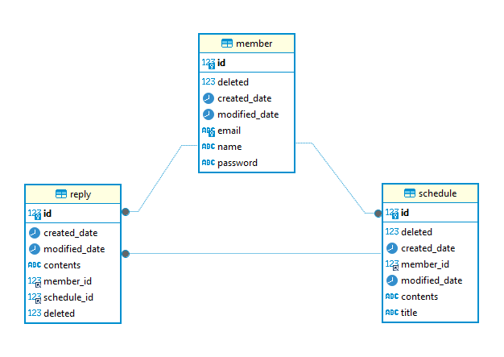

# 스파르타 내임배움캠프 일정 관리 JPA

--- 
## 차례

[🚀 과제내용](#과제-내용)

[📝 ERD](#ERD)

[🔍 Swagger](#Swagger-URL)

[📂 Auth API 명세서](#Auth-API-명세서)

[📂 Schedule API 명세서](#Schedule-API-명세서)

[📂 마이페이지 API 명세서](#마이페이지-API-명세서)

[📂 Reply API 명세서](#Reply-API-명세서)

[⚠️ 개발자 참고 - 예외 처리](#개발자-참고---예외-처리)

[📤 공통 응답 형식](#공통-응답-형식)

---
## 과제 내용

### ✅ 기본 구현 요구사항 (필수)

#### 1️⃣ 일정 CRUD
- 일정 등록 시 저장 데이터:
  - 할일 제목
  - 할일 내용
  - 작성자명
  - 작성일/수정일 (날짜와 시간 포함)
- 일정 고유 ID 자동 생성
- 작성일과 수정일은 JPA Auditing 활용

#### 2️⃣ 유저 CRUD
- 유저 등록 시 저장 데이터:
  - 유저명
  - 이메일
  - 작성일/수정일 (날짜와 시간 포함)
- 유저 고유 ID 자동 생성
- 작성일과 수정일은 JPA Auditing 활용
- 일정과 작성 연관관계 구현

#### 3️⃣ 회원가입
- 유저 `비밀번호` 필드 추가

#### 4️⃣ 로그인(인증)
- `Cookie/Session`을 활용해 로그인 기능을 구현
- `이메일`과 `비밀번호`를 활용해 로그인 기능을 구현
- 회원가입, 로그인 요청은 인증 처리에서 제외
- 예외처리
  - 로그인 실패 시 `401` 반환

---

### 🚀 도전 기능 (선택)

#### 1️⃣ 다양한 예외처리 적용
- Validation 적용 ex) @Valid, @Pattern

#### 2️⃣ 비밀번호 암호화
- `비밀번호`에 암호화 적용
  - `PasswordEncoder` 활용 

#### 3️⃣ 댓글 CRUD
- 댓글 등록 시 저장 데이터:
  - 댓글 내용
  - 작성일/수정일 (날짜와 시간 포함)
  - 유저 고유 ID
  - 일정 고유 ID
- 댓글 고유 ID 자동 생성
- 작성일과 수정일은 JPA Auditing 활용
- 일정, 유저와 작성 연관관계 구현

#### 4️⃣ 일정 페이징 조회
- `Pageable`, `Page` 활용한 페이지네이션
- `페이지 번호`, `페이지 크기`를 요청
- `할일 제목`, `할일 내용`, `댓글 개수`, `일정 작성일`, `일정 수정일`, `일정 작성 유저명 필드`를 조회
- `수정일` 기준 내림차순 조회
---

### 📋Languages


### 📚 Frameworks, Platforms and Libraries


### 💾 Databases


### 🥅 Other


---
## 📝ERD


---

## 🔍Swagger URL

```
/swagger-ui/index.html#
```
---
## 📂Schedule API 명세서

### 🔍 Base URL

```
/api/schedule
```

---

### ✅ API 목록 요약

| Method | Endpoint           | 설명             |
|--------|--------------------|----------------|
| POST   | /api/schedule      | 일정 등록          |
| GET    | /api/schedule      | 일정 목록 조회 (페이징) |
| GET    | /api/schedule/{id} | 일정 상세 조회       |
| PUT    | /api/schedule/{id} | 일정 수정          |
| DELETE | /api/schedule/{id} | 일정 삭제          |

---

### ✅ 1. 일정 등록

- **URL** : `POST /api/schedule`
- **요청 Body 필드**
- | 필드명      | 타입     | 필수 | 설명     |
  |----------|--------|------|--------|
  | title    | String | O    | 일정 제목  |
  | contents | String | O    | 일정 내용  |

- **Body Example (JSON)**

```json
{
  "title": "string",
  "contents": "string"
}
```

- **Response Example**

```json
{
  "data": {
    "id": 0,
    "title": "string",
    "contents": "string",
    "regNm": "string",
    "createdDate": "2025-03-27T15:10:27.854Z",
    "modifiedDate": "2025-03-27T15:10:27.854Z",
    "replyList": [
      {
        "id": 0,
        "scheduleId": 0,
        "contents": "string",
        "regNm": "string",
        "createdDate": "2025-03-27T15:10:27.854Z",
        "modifiedDate": "2025-03-27T15:10:27.854Z"
      }
    ]
  },
  "result": {
    "status": 200,
    "code": "A000",
    "message": "요청 처리 성공",
    "timestamp": "2025-03-27T15:10:27.854Z"
  }
}
```

---

### ✅ 2. 일정 목록 조회

- **URL** : `GET /api/schedule`
- **Query Params**
- | 필드 | 타입 | 필요 | 설명 |
  |--------|------|------|------|
  | page | int | 선택 (기본 1) | 페이지 번호 (1부터) |
  | size | int | 선택 (기본 10) | 페이지 크기 (최대 100) |

- **Response Example**

```json
{
  "data": {
    "data": [
      {
        "id": 0,
        "title": "string",
        "contents": "string",
        "regNm": "string",
        "createdDate": "2025-03-27T15:12:31.603Z",
        "modifiedDate": "2025-03-27T15:12:31.603Z",
        "replyCnt": 0
      }
    ],
    "total": 0,
    "size": 0,
    "page": 0,
    "totalPages": 0
  },
  "result": {
    "status": 200,
    "code": "A000",
    "message": "요청 처리 성공",
    "timestamp": "2025-03-27T15:12:31.603Z"
  }
}
```

---

### ✅ 3. 일정 상세 조회

- **URL** : `GET /api/schedule/{id}`

- **Response Example**

```json
{
  "data": {
    "id": 0,
    "title": "string",
    "contents": "string",
    "regNm": "string",
    "createdDate": "2025-03-27T15:13:26.322Z",
    "modifiedDate": "2025-03-27T15:13:26.322Z",
    "replyList": [
      {
        "id": 0,
        "scheduleId": 0,
        "contents": "string",
        "regNm": "string",
        "createdDate": "2025-03-27T15:13:26.322Z",
        "modifiedDate": "2025-03-27T15:13:26.322Z"
      }
    ]
  },
  "result": {
    "status": 200,
    "code": "A000",
    "message": "요청 처리 성공",
    "timestamp": "2025-03-27T15:13:26.322Z"
  }
}
```

---

### ✅ 4. 일정 수정

- **URL** : `PUT /api/schedule/{id}`
- **요청 Body 필드**
- | 필드명      | 타입     | 필수 | 설명    |
  |----------|--------|------|-------|
  | title    | String | O    | 일정 제목 |
  | contents | String | O    | 일정 내용 |

- **Body Example (JSON)**

```json
{
  "title": "string",
  "contents": "string"
}
```

- **Response Example**

```json
{
  "data": {
    "id": 0,
    "title": "string",
    "contents": "string",
    "regNm": "string",
    "createdDate": "2025-03-27T15:14:25.844Z",
    "modifiedDate": "2025-03-27T15:14:25.844Z",
    "replyList": [
      {
        "id": 0,
        "scheduleId": 0,
        "contents": "string",
        "regNm": "string",
        "createdDate": "2025-03-27T15:14:25.844Z",
        "modifiedDate": "2025-03-27T15:14:25.844Z"
      }
    ]
  },
  "result": {
    "status": 200,
    "code": "A000",
    "message": "요청 처리 성공",
    "timestamp": "2025-03-27T15:14:25.844Z"
  }
}
```

---

### ✅ 5. 일정 삭제 (Delete Schedule)

- **URL** : `DELETE /api/schedule/{id}`

- ✔ 성공 시 Boolean 반환

```json
{
  "data": true,
  "result": {
    "status": 200,
    "code": "A000",
    "message": "요청 처리 성공",
    "timestamp": "2025-03-27T15:15:30.390Z"
  }
}
```

---
## 📂마이페이지 API 명세서
### 🔍 Base URL

```
/api/member/me
```

---

### ✅ API 목록 요약

| Method | Endpoint                | 설명      |
|--------|-------------------------|---------|
| GET    | /api/member/me          | 내 정보 조회 |
| PUT    | /api/member/me          | 내 정보 수정 |
| DELETE | /api/member/me          | 회원 탈퇴   |
| PUT    | /api/member/me/password | 비밀번호 수정 |

---

### ✅ 1. 내 정보 조회

- **URL** : `GET /api/member/me`
- **요청 Body 필드**
- **Response Example**

```json
{
  "data": {
    "id": 0,
    "name": "string",
    "email": "string",
    "createdDate": "2025-03-27T17:11:18.423Z",
    "modifiedDate": "2025-03-27T17:11:18.423Z"
  },
  "result": {
    "status": 200,
    "code": "A000",
    "message": "요청 처리 성공",
    "timestamp": "2025-03-27T17:11:18.423Z"
  }
}
```

---
### ✅ 2. 내 정보 수정

- **URL** : `PUT /api/member/me`
- **요청 Body 필드**
- | 필드명  | 타입     | 필수 | 설명 |
  |------|--------|------|----|
  | name | String | O    | 이름 |

- **Body Example (JSON)**

```json
{
  "name": "string"
}
```

- **Response Example**

```json
{
  "data": {
    "id": 0,
    "name": "string",
    "email": "string",
    "createdDate": "2025-03-27T17:11:50.731Z",
    "modifiedDate": "2025-03-27T17:11:50.731Z"
  },
  "result": {
    "status": 200,
    "code": "A000",
    "message": "요청 처리 성공",
    "timestamp": "2025-03-27T17:11:50.731Z"
  }
}
```

---
### ✅ 3. 회원 탈퇴

- **URL** : `DELETE /api/member/me`

- **Response Example**

```json
{
  "data": true,
  "result": {
    "status": 200,
    "code": "A000",
    "message": "요청 처리 성공",
    "timestamp": "2025-03-27T15:19:16.791Z"
  }
}
```

---
### ✅ 4. 비밀번호 수정

- **URL** : `PUT /api/member/me/password`
- **요청 Body 필드**
- | 필드명     | 타입    | 필수 | 설명      |
    |-----------|--------|------|---------|
  | currentPw | String | O    | 현재 비밀번호 |
  | newPw     | String | O    | 새 비밀번호  |

- **Body Example (JSON)**

```json
{
  "currentPw": "string",
  "newPw": "string"
}
```

- **Response Example**

```json
{
  "data": true,
  "result": {
    "status": 200,
    "code": "A000",
    "message": "요청 처리 성공",
    "timestamp": "2025-03-27T17:13:47.808Z"
  }
}
```

---

## 📂Auth API 명세서
### 🔍 Base URL

```
/api/auth
```

---

### ✅ API 목록 요약

| Method | Endpoint         | 설명    |
|--------|------------------|-------|
| POST   | /api/auth/signup | 회원가입 |
| POST   | /api/auth/login  | 로그인   |
| POST   | /api/auth/logout | 로그아웃  |

---

### ✅ 1. 회원가입

- **URL** : `POST /api/auth/signup`
- **요청 Body 필드**
- | 필드명      | 타입     | 필수 | 설명   |
  |----------|--------|------|------|
  | name     | String | O    | 이름   |
  | email    | String | O    | 이메일  |
  | password | String | O    | 비밀번호 |

- **Body Example (JSON)**

```json
{
  "name": "string",
  "email": "string",
  "password": "string"
}
```

- **Response Example**

```json
{
  "data": {
    "id": 0,
    "name": "string",
    "email": "string",
    "createdDate": "2025-03-27T15:17:39.172Z",
    "modifiedDate": "2025-03-27T15:17:39.172Z"
  },
  "result": {
    "status": 200,
    "code": "A000",
    "message": "요청 처리 성공",
    "timestamp": "2025-03-27T15:17:39.172Z"
  }
}
```

---
### ✅ 2. 로그인

- **URL** : `POST /api/auth/login`
- **요청 Body 필드**
- | 필드명      | 타입     | 필수 | 설명   |
  |----------|--------|------|------|
  | email    | String | O    | 이메일  |
  | password | String | O    | 비밀번호 |

- **Body Example (JSON)**

```json
{
  "email": "string",
  "password": "string"
}
```

- **Response Example**

```json
{
  "data": true,
  "result": {
    "status": 200,
    "code": "A000",
    "message": "요청 처리 성공",
    "timestamp": "2025-03-27T15:19:16.791Z"
  }
}
```

---
### ✅ 3. 로그아웃

- **URL** : `POST /api/auth/logout`

- **Response Example**

```json
{
  "data": true,
  "result": {
    "status": 200,
    "code": "A000",
    "message": "요청 처리 성공",
    "timestamp": "2025-03-27T15:19:16.791Z"
  }
}
```
---

## 📂Reply API 명세서

### 🔍 Base URL

```
/api/reply
```

---

### ✅ API 목록 요약

| Method | Endpoint        | 설명       |
|--------|-----------------|----------|
| POST   | /api/reply      | 댓글 등록    |
| GET    | /api/reply/{id} | 댓글 상세 조회 |
| PUT    | /api/reply/{id} | 댓글 수정    |
| DELETE | /api/reply/{id} | 댓글 삭제    |

---

### ✅ 1. 댓글 등록

- **URL** : `POST /api/reply`
- **요청 Body 필드**
- | 필드명        | 타입     | 필수 | 설명    |
  |------------|--------|------|-------|
  | scheduleId | Long   | O    | 일정 ID |
  | contents   | String | O    | 댓글 내용 |

- **Body Example (JSON)**

```json
{
  "scheduleId": 0,
  "contents": "string"
}
```

- **Response Example**

```json
{
  "data": {
    "id": 0,
    "scheduleId": 0,
    "contents": "string",
    "regNm": "string",
    "createdDate": "2025-03-27T17:16:07.734Z",
    "modifiedDate": "2025-03-27T17:16:07.734Z"
  },
  "result": {
    "status": 200,
    "code": "A000",
    "message": "요청 처리 성공",
    "timestamp": "2025-03-27T17:16:07.734Z"
  }
}
```

---

### ✅ 2. 댓글 상세 조회

- **URL** : `GET /api/reply/{id}`

- **Response Example**

```json
{
  "data": {
    "id": 0,
    "scheduleId": 0,
    "contents": "string",
    "regNm": "string",
    "createdDate": "2025-03-27T17:17:24.943Z",
    "modifiedDate": "2025-03-27T17:17:24.943Z"
  },
  "result": {
    "status": 200,
    "code": "A000",
    "message": "요청 처리 성공",
    "timestamp": "2025-03-27T17:17:24.943Z"
  }
}
```

---

### ✅ 3. 댓글 수정

- **URL** : `PUT /api/reply/{id}`
- **요청 Body 필드**
- | 필드명      | 타입     | 필수 | 설명    |
  |----------|--------|------|-------|
  | contents | String | O    | 일정 내용 |

- **Body Example (JSON)**

```json
{
  "contents": "string"
}
```

- **Response Example**

```json
{
  "data": {
    "id": 0,
    "scheduleId": 0,
    "contents": "string",
    "regNm": "string",
    "createdDate": "2025-03-27T17:17:40.098Z",
    "modifiedDate": "2025-03-27T17:17:40.098Z"
  },
  "result": {
    "status": 200,
    "code": "A000",
    "message": "요청 처리 성공",
    "timestamp": "2025-03-27T17:17:40.098Z"
  }
}
```

---

### ✅ 4. 댓글 삭제

- **URL** : `DELETE /api/reply/{id}`

- ✔ 성공 시 Boolean 반환

```json
{
  "data": true,
  "result": {
    "status": 200,
    "code": "A000",
    "message": "요청 처리 성공",
    "timestamp": "2025-03-27T17:18:05.303Z"
  }
}
```

---
## ⚠️개발자 참고 - 예외 처리

| HTTP Status | 설명               |
|-------------|------------------|
| 200         | 성공               |
| 400         | 잘못된 요청 / 파라미터 오류 |
| 401         | UNAUTHORIZED     |
| 403         | Access Denied    |
| 404         | 데이터 없음           |
| 500         | 에러               |

- 📌 모든 실패 응답은 `BaseResponse`로 감싸서 내려감

---

### 📤공통 응답 형식
### BaseResponse
```json
{
  "data": {},
  "result": {
    "status": 200,
    "code": "코드",
    "message": "메시지",
    "timestamp": "시간"
  }
}
```

---